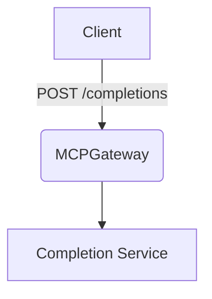

# ✨ Feature / Enhancement PR

## 🔗 Epic / Issue

_Link to the epic or parent issue:_
Closes #

---

## 🚀 Summary (1-2 sentences)

_What does this PR add or change?_

---

## 📏 Reviewability

- [ ] This PR has one clear purpose
- [ ] The linked issue is not labeled `triage`
- [ ] Unrelated bugs or improvements are tracked in separate issues/PRs
- [ ] Tests are included with the code they validate
- [ ] If AI-assisted, I understand and can explain the generated changes

---

## 🧪 Checks

_List exact commands, screenshots, videos, logs, validation steps, or explain why evidence is not feasible._

- [ ] `make lint` passes
- [ ] `make test` passes
- [ ] CHANGELOG updated (if user-facing)

---

## 📓 Notes (optional)

_Design sketch or extra context._

If the change introduces or alters an architectural decision, add or update an ADR in **`docs/docs/adr/`** and link it here._

